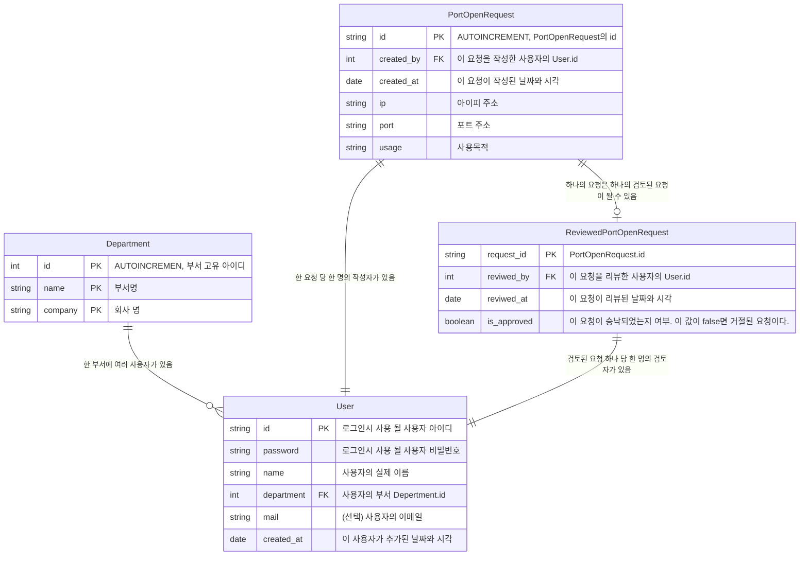
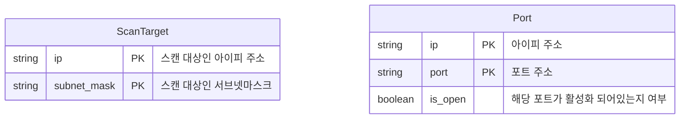
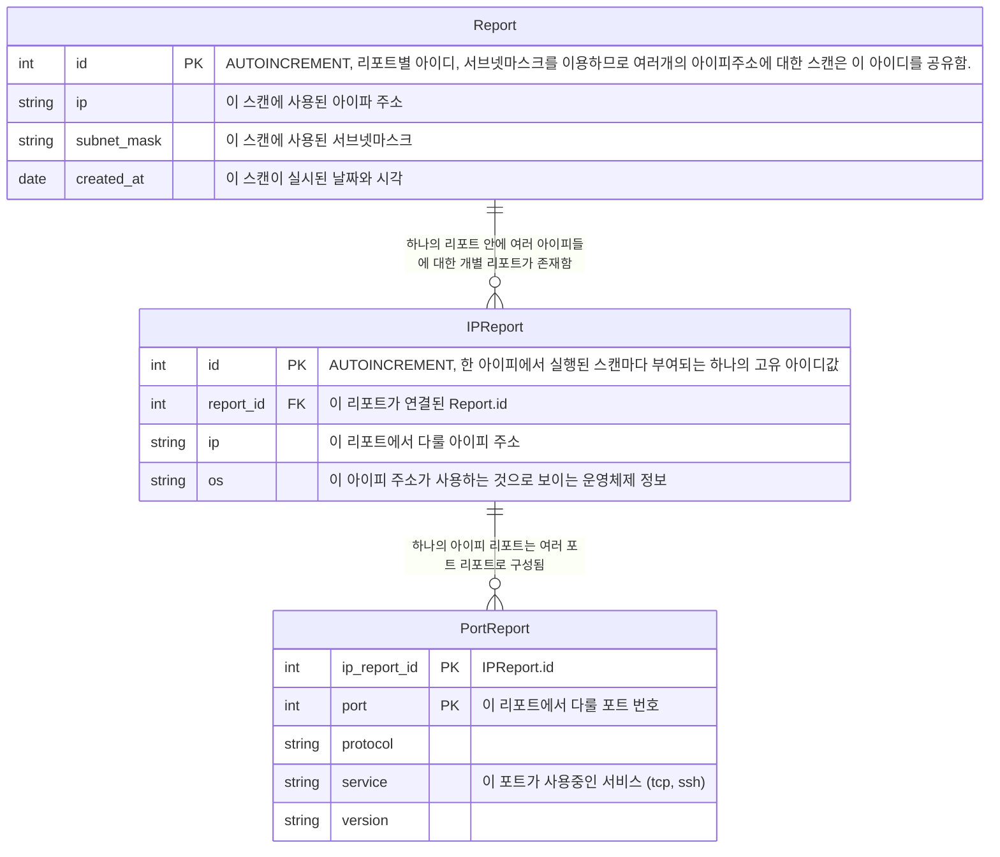
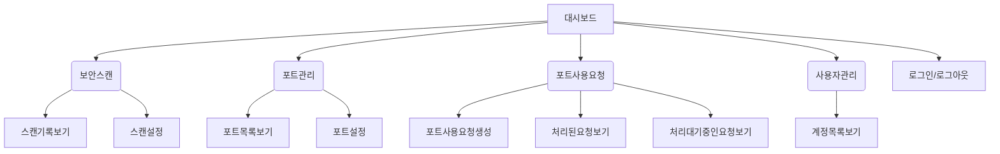
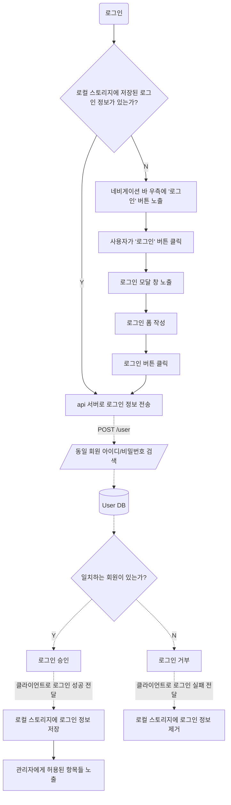

# Dependency

의존성

| `npm` 모듈 명      | 설명                                                                                                                                                                                                                                                                            |
| ------------------ | ------------------------------------------------------------------------------------------------------------------------------------------------------------------------------------------------------------------------------------------------------------------------------- |
| `react`            | 기존 프로젝트에서 리엑트를 사용하고 있었기에 그대로 차용함.                                                                                                                                                                                                                     |
| `typescript`       | 자바스크립트의 슈퍼셋인 오픈소스 프로그래밍 언어이다. 명확한 자료형 구분을 통해 엄격한 개발환경을 구축하기 위해 도입하였다.                                                                                                                                                     |
| `axios`            | 백엔드에서 제공하는 RESTful API를 통해 정보를 받아오는 과정에서 사용하기 위해 도입. REST api 환경을 구축하고 사용할 때 유용한 기능들을 제공한다.                                                                                                                                |
| `jest`             | 단위테스트 프레임워크. 프론트엔드를 위해서보다는 백엔드에서 제공하는 api의 신뢰성을 검증하기 위한 단위테스트 코드를 작성할 때 사용되었다.                                                                                                                                       |
| `react-router-dom` | 브라우저의 주소 바에 사용자의 위치를 담고, JSX 문법을 지원하는 브라우저 라우터를 구현하기 위해 도입.                                                                                                                                                                            |
| `bootstrap`        | 웹사이트를 쉽게 만들 수 있게 도와주는 CSS, JS 프레임워크이다. 사전 정의된 CSS class 원하는 HTML 태그에 부여하여 쉽고 빠르게 널리 알려진 웹 구성 요소들을 만들어 낼 수 있다. 다양한 기능을 제공하며, 다양한 기기에서 안정적으로 작동하기에 유용하여 빠른 개발을 위해 도입하였다. |
| `react-bootstrap`  | `bootstrap`프레임워크를 JSX 문법에서 사용가능하게 해주는 바인딩이다.                                                                                                                                                                                                            |
| `chart.js`         | 다양한 종류의 차트를 javascript 문법을 통해 쉽고 빠르게 생성할 수 있게 해주는 프레임워크이다. 일부 위젯에서 자료를 시각화하는데 사용되었다.                                                                                                                                     |
| `react-chartjs-2`  | JSX 문법을 통해 `chart.js`의 기능을 사용할 수 있게해주는 바인딩이다.                                                                                                                                                                                                            |

# History

## v0.0.1 (~2022-11-07, 김동주, 김보민, 윤수민)

-   Javascript를 사용한 React.js와 bootstrap을 이용하여 구현
-   총 5개의 페이지로 구성 됨: Main, Compare, Auth, Reject, Join

## v0.1.0 (2022-11-08, 김동주, 임세원)

-   [Back-End] 서비스 구조 재점검
-   [Back-End] 데이터베이스 개선안 작성
-   [Front-End] Typescript로 기존의 프로젝트 포팅
-   [Front-End] A4용지에 그려진 교수님의 피드백을 바탕으로 대시보드 구현
    -   대시보드에 `현재 활성화된 호스트 수`/`허가된 호스트 수`를 보여주는 위젯 추가
    -   대시보드에 **최근에 작성된 포트 사용 요청**을 보여주는 위젯 추가
    -   대시보드에 **라즈베리파이 CPU, DISK, MEMORY, NETWORK 사용량**을 보여주는 위젯 추가

<details><summary>추가 자료</summary>

교수님 피드백:


데이터베이스 개선안:


</details>

## v0.1.1 (2022-11-14, 김동주)

-   [Back-End] 데이터베이스 세부 구조 설계
-   [Back-End] 필요한 api 1차 청구
    1. 사용중인 모든 ip/port 정보를 보내주는 것.
    2. 열려있는 모든 ip/port 정보를 보내주는 것.
    3. 닫혀있는 모든 ip/port 정보를 보내주는 것.
    4. 머신 상태 정보
-   [Back-End] 앞으로 만들어야 할 api 제시
    -   비로그인 사용자에게 열린 기능:
        -   대쉬보드
        -   회원가입
    -   로그인 한 일반 사용자에게 열린 기능:
        -   비로그인 사용자에게 열린 기능
        -   새로운 포트 신청
        -   자기 신청한 내역 열람 (거절/승낙)
    -   관리자에게 열린 기능:
        -   로그인 한 일반 사용자에게 열린 기능
        -   처리 대기중인 요청 열람
        -   처리 대기중인 요청 승낙
        -   처리 대기중인 요청 거절
        -   처리한 모든 요청 열람
-   [Front-End] 사이트 맵 1차 작성
-   [Front-End] 포트 관리 페이지 설계. (포트 요청, 포트 목록, )
-   [Front-End] 스캔 대상 목록 페이지 설계. <span style="color: rgba(0,0,0,.35)">Back-End에서 스캔 대상 ip, subnet mask 목록을 관리하는 방식 변경 / iptables.txt 파일을 직접 수정하는 방식 대신, 클라이언트에서 스캔 대상을 추가하고 열람할 수 있는 페이지를 새로 설계 함</span>

<details><summary>추가 자료</summary>

사이트 맵:

```text
/                       # (랜딩페이지) 대시보드
├── scan/               # 보안 스캔 기록
│   └── settings/       # 보안 스캔 설정
└── port/               # 허용된 포트 관리
```

데이터베이스 세부 구조:


포트 정보 형식:

```json
[
    {
        host: string, // ip 주소
        port: number, // 포트 번호
        modified: string // 최근 수정일. ISO String 형식 사용 - javascript Date 객체의 .toISOString() 이용
    },
    ...
]
```

머신 상태 정보 형식:

```json
{
    cpu: number, // CPU 사용량 0.0 (0%) ~ 1.0 (100%) 로 표현
    disk: number,
    memory: number,
    network: number
}
```

</details>

## v0.1.2 (2022-11-17, 김동주)

-   [Front-End] 사이트 맵 2차 작성, 로드맵 구성
-   [Front-End] api 인터페이스 설계
-   [Back-End] Back-End 데이터베이스 구조 재설계

<details><summary>추가 자료</summary>

세부 api 리스트:

-   <https://gist.github.com/Hepheir/67608a02a7414260edd20d7f878bbe10>

사이트 맵 및 로드맵 (x표시된 항목은 구현 완료, 빈 칸은 미완료):

```diff
 -   대시보드/
 -   보안 스캔/
+    -   [x] 스캔 기록 보기
+    -   [x] 스캔 설정 (설정 변경 혹은 스캔 실행)
 -   포트 관리/
+    -   [x] 포트 상태 보기
+    -   [x] 포트 설정 (포트 열고 닫기)
 -   포트 사용 요청/
     -   [ ] 요청 생성
+    -   [x] 처리된 요청 보기
+    -   [x] 처리 대기중인 요청 보기 (및 처리하기)
 -   사용자 관리/
     -   [ ] 계정 추가하기
     -   [ ] 계정 목록 보기
+    -   [x] 로그인
```

데이터 베이스 구조 (ER 다이어그램):







데이터베이스 구조(클래스다이어그램):


</details>

## v0.1.3 (2022-11-22, 김동주)

-   [Front-End] v0.1.1 에서 작성한 로드맵 항목 모두 구현 완료
-   [Front-End] 브라우저의 sessionStorage 를 이용하여 목업 api 구현
-   [Front-End] Back-End의 api 완성시 사용할 api 클라이언트 구현 (`axios` 라이브러리 이용)
-   [Front-End] Back-End의 api 완성시 원할한 연결을 위한 api 테스트 코드 작성 (`jest`라이브러리 이용)
-   [Front-End] 코드 재사용성을 위한 대규모 리펙토링

<details><summary>추가 자료</summary>

사이트맵 & 로드맵:

```diff
 -   대시보드/
 -   보안 스캔/
     -   [x] 스캔 기록 보기
     -   [x] 스캔 설정 (설정 변경 혹은 스캔 실행)
 -   포트 관리/
     -   [x] 포트 상태 보기
     -   [x] 포트 설정 (포트 열고 닫기)
 -   포트 사용 요청/
+    -   [x] 요청 생성
     -   [x] 처리된 요청 보기
     -   [x] 처리 대기중인 요청 보기 (및 처리하기)
 -   사용자 관리/
+    -   [x] 계정 추가하기
+    -   [x] 계정 목록 보기
     -   [x] 로그인
```

</details>

# Menu Structure (Sitemap)



<table>
    <thead>
        <tr>
            <th>대매뉴</th>
            <th>중메뉴</th>
            <th>구성 위젯</th>
            <th>위젯 파일명</th>
            <th>설명</th>
        </tr>
    </thead>
    <tbody>
        <tr>
            <td rowspan="4" colspan="2">대시보드</td>
            <td>현재 활성화 된 포트 통계</td>
            <td>/components/port-active-statistic</td>
            <td>현재 활성화 되어있는 포트 수 / 허가된 포트 개수를 간단하게 보여주는 위젯이다.</td>
        </tr>
        <tr>
            <td>최근 포트 사용 요청</td>
            <td>components/port-request-list</td>
            <td>최근에 추가된 모든 요청을 목록으로 보여준다. 각 요청마다 우측에 배지를 통해 검토 대기중/허가됨/거부됨 여부를 함께 보여준다.</td>
        </tr>
        <tr>
            <td>포트 목록</td>
            <td>/components/port-list</td>
            <td>서버에 알려진 포트 포트들을 목록의 형태로 보여준다.</td>
        </tr>
        <tr>
            <td>실시간 장치 사용량</td>
            <td>/components/machine-monitoring</td>
            <td>실시간으로 장치(라즈베리파이)가 사용중인 CPU, Disk, Memory를 bar형태의 gui와 함께 백분율로 보여준다.</td>
        </tr>
        <tr>
            <td rowspan="4">보안 스캔</td>
            <td>스캔 기록 보기</td>
            <td>날짜별 스캔 기록</td>
            <td>/components/report-list</td>
            <td>상단에 날짜별로 나누어진 페이지네이션을 포함하며, 좌측엔 리스트, 우측엔 도넛 차트로 구성된 리포트 목록</td>
        </tr>
        <tr>
            <td rowspan="3">스캔 설정</td>
            <td>Nmap 스캔</td>
            <td>/components/scan-immediately</td>
            <td>지금 즉시 Nmap 스캔을 실시하는 버튼을 포함한 위젯</td>
        </tr>
        <tr>
            <td>스캔 규칙 추가</td>
            <td>/components/scan-add-rule</td>
            <td>스캔할 주소를 추가할 수 있는 위젯. 아이피 주소와 서브넷 마스크를 입력할 수 있다.</td>
        </tr>
        <tr>
            <td>스캔 대상 IP 주소 목록</td>
            <td>/components/scan-address-list</td>
            <td>스캔 대상 아이피 주소와 서브넷 마스크를 목록으로 보여줌.</td>
        </tr>
        <tr>
            <td rowspan="3">포트 관리</td>
            <td>포트 목록 보기</td>
            <td>포트 목록</td>
            <td>/components/port-list</td>
            <td>포트 목록을 보여준다. 각 포트별 온라인/오프라인 여부와 허가되었는지 여부를 해당 포트의 우측에 배지를 통해 보여준다.</td>
        </tr>
        <tr>
            <td rowspan="2">포트 설정</td>
            <td>새 포트 열기</td>
            <td>/components/port-open-new</td>
            <td>새로 열 포트의 아이피 주소와 포트 번호를 입력할 수 있는 폼이다. 폼을 제출하면 api를 통해 서버에 해당 포트를 열도록 지시한다.</td>
        </tr>
        <tr>
            <td>포트 열기/닫기</td>
            <td>/components/port-toggle-pannel</td>
            <td>각 포트마다 우측에 스위치 버튼을 통해 열기/닫기를 토글하는 기능을 함께 제공한다.</td>
        </tr>
        <tr>
            <td rowspan="3">포트 사용 요청</td>
            <td>포트 사용 요청 생성</td>
            <td>요청 작성하기</td>
            <td>/components/port-request-create</td>
            <td>아이피 주소와 포트번호, 사용목적을 입력하는 폼이다. 제출시 api를 통해 서버에 사용요청을 생성하도록 지시한다.</td>
        </tr>
        <tr>
            <td>처리된 요청 보기</td>
            <td>요청 목록</td>
            <td></td>
            <td>처리 완료된 요청을 [포트 정보/사용 목적/요청 생성일/요청 작성자/리뷰어/처리결과]의 정보들을 표 형식으로 보여준다.</td>
        </tr>
        <tr>
            <td>처리 대기 중인 요청 보기</td>
            <td>처리 대기 중인 요청 목록</td>
            <td>/components/port-request-pending-list</td>
            <td>아직 처리되지 않은 포트 사용 요총들을 표 형식으로 보여준다. 각 요청마다 우측에 [승낙/거절] 버튼을 표시해두어, 해당 버튼을 눌러 즉시 요청을 처리할 수 있다.</td>
        </tr>
        <tr>
            <td rowspan="2">사용자 요청</td>
            <td rowspan="2">계정 목록 보기</td>
            <td>사용자 목록</td>
            <td>/components/user-list</td>
            <td>서버에 있는 사용자 목록을 불러와 보여준다.</td>
        </tr>
        <tr>
            <td>사용자 추가하기</td>
            <td>/components/user-add</td>
            <td>새로운 사용자를 생성할 수 있는 폼이다. 제출시 api를 통해 서버에 사용자를 생성하도록 지시한다.</td>
        </tr>
    </tbody>
</table>

# Design

설계

## Flowchart

### 로그인



## Permission

각 페이지별 권한 정책.

모든 로그인 된 사용자는 관리자로 가정하므로, 본 서비스는 비로그인 사용자와 관리자만을 구분짓는다.

<table>
    <thead>
        <tr>
            <th>대매뉴</th>
            <th>중메뉴</th>
            <th>사용자 구분</th>
            <th>Access</th>
            <th>비고</th>
        </tr>
    </thead>
    <tbody>
        <tr>
            <td rowspan="2" colspan="2">대시보드</td>
            <td>비로그인 사용자</td>
            <td rowspan="2">O</td>
            <td rowspan="2">비로그인 사용자가 접속하거나, 관리자가 로그아웃 할 시, 이 곳으로 유도됨.</td>
        </tr>
        <tr>
            <td>관리자</td>
        </tr>
        <tr>
            <td rowspan="6">보안 스캔</td>
            <td rowspan="2">스캔 기록 보기</td>
            <td>비로그인 사용자</td>
            <td>X</td>
            <td rowspan="2"></td>
        </tr>
        <tr>
            <td>관리자</td>
            <td>O</td>
        </tr>
        <tr>
            <td rowspan="2">스캔 설정</td>
            <td>비로그인 사용자</td>
            <td>X</td>
            <td rowspan="2"></td>
        </tr>
        <tr>
            <td>관리자</td>
            <td>O</td>
        </tr>
        <tr>
            <td rowspan="2">스캔 대상 IP 주소 목록</td>
            <td>비로그인 사용자</td>
            <td>X</td>
            <td rowspan="2"></td>
        </tr>
        <tr>
            <td>관리자</td>
            <td>O</td>
        </tr>
        <tr>
            <td rowspan="4">포트 관리</td>
            <td rowspan="2">포트 목록 보기</td>
            <td>비로그인 사용자</td>
            <td>X</td>
            <td rowspan="2"></td>
        </tr>
        <tr>
            <td>관리자</td>
            <td>O</td>
        </tr>
        <tr>
            <td rowspan="2">포트 설정</td>
            <td>비로그인 사용자</td>
            <td>X</td>
            <td rowspan="2"></td>
        </tr>
        <tr>
            <td>관리자</td>
            <td>O</td>
        </tr>
        <tr>
            <td rowspan="4">포트 사용 요청</td>
            <td rowspan="2">포트 사용 요청 생성</td>
            <td>비로그인 사용자</td>
            <td>X</td>
            <td rowspan="2"></td>
        </tr>
        <tr>
            <td>관리자</td>
            <td>O</td>
        </tr>
        <tr>
            <td rowspan="2">처리된 요청 보기</td>
            <td>비로그인 사용자</td>
            <td>X</td>
            <td rowspan="2"></td>
        </tr>
        <tr>
            <td>관리자</td>
            <td>O</td>
        </tr>
        <tr>
            <td rowspan="4">사용자 요청</td>
            <td rowspan="2">계정 목록 보기</td>
            <td>비로그인 사용자</td>
            <td>X</td>
            <td rowspan="2"></td>
        </tr>
        <tr>
            <td>관리자</td>
            <td>O</td>
        </tr>
        <tr>
            <td rowspan="2">사용자 추가하기</td>
            <td>비로그인 사용자</td>
            <td>X</td>
            <td rowspan="2"></td>
        </tr>
        <tr>
            <td>관리자</td>
            <td>O</td>
        </tr>
    </tbody>
</table>

# [Back-End] API 명세

RESTful 을 지향하며 최대한 CRUD[^crud] 작업을 포함하도록 각 api를 설계하였다.

개발 기간이 충분하지 못해 설계가 미흡하고, 일부 구현되지 않은 api들이 있다.

## User

## Port

## Request

## Report

## Scan

[^crud]: Create, Read, Update, Delete
