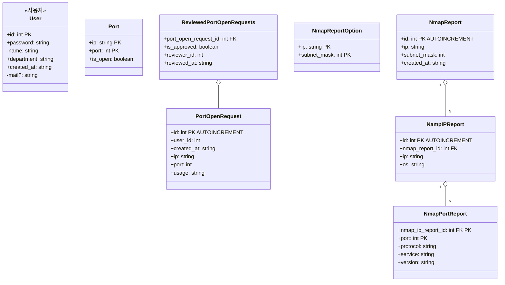

첫 화면이 로그인 ->

사용자 : 일반 | 관리자

메인페이지:
관리자 -> 대시보드 (+@)
일반 -> 대시보드

관리자만 볼 수 있는 것: 비교, 요청, 거절, 아이디생성



-   [ ] 서버 용도
-   [x] DB 구조
-   [ ] 서버 api 사용법
-   [ ] 쉘스크립트 & 사용법
-   [ ] 대시보드에 들어가야 할 것
-   [ ] 어디까지 만들어야하는가
    -   프론트 <-> 서버
    -   디비?
-   [ ] 디비를 제 컴퓨터서 구동
-   [ ] 비용?

|                              | 난이도 | 시간  | 인원 |
| ---------------------------- | ------ | ----- | ---- |
| nmap(shell programming)      | 4      | 1~2   | 1    |
| server(express.js, rest api) | 5      | 1(~4) | 1    |
| client(react.js)             | 2~3    | 5++   | 1    |
| + 발표(피피티&보고서)        | 1      | 4     | 1    |

nmap


## 위젯

6. ?
7. 머신 사용량
    1. { cpu: 0.0~1.0, disk: 0.0~1.0, memory: 0.0~1.0, network: 0.0~1.0 }


**지금 필요한 api**:

1. 사용중인 모든 ip/port 정보를 보내주는 것.
2. 열려있는 모든 ip/port 정보를 보내주는 것.
3. 닫혀있는 모든 ip/port 정보를 보내주는 것.

ip/port 정보 형식:
```
[
    {
        host: string, // ip 주소
        port: number, // 포트 번호
        modified: string // 최근 수정일. ISO String 형식 사용 - javascript Date 객체의 .toISOString() 이용
    },
    ...
]
```

4. 머신 상태 정보

정보 형식:
```
{
    cpu: number, // CPU 사용량 0.0 (0%) ~ 1.0 (100%) 로 표현
    disk: number,
    memory: number,
    network: number
}
```

# API 명세

## API BASE URL

`http://211.203.128.59:3001/api/`


### 열려있는 주소

`GET /ip_open`

```json
[
    {
        host: string, // ip 주소 (예시: "192.168.10.1")
        port: number, // 포트 번호 (예시: 22)
        service: string, // 사용중인 서비스 (예시: "ssh")
        last_scanned_date: string // 마지막 스캔된 날짜. (예시: "2022-11-06")
    },
    ...
]
```

### 닫혀있는 주소

`GET /ip_close`

```json
[
    {
        host: string, // ip 주소 (예시: "192.168.10.1")
        port: number, // 포트 번호 (예시: 22)
        service: string, // 사용중인 서비스 (예시: "ssh")
        last_scanned_date: string // 마지막 스캔된 날짜. (예시: "2022-11-06")
    },
    ...
]
```

### 사용중인 주소

`GET /ip_use`

```json
[
    {
        host: string, // ip 주소 (예시: "192.168.10.1")
        port: number, // 포트 번호 (예시: 22)
        service: string, // 사용중인 서비스 (예시: "ssh")
        last_scanned_date: string // 마지막 스캔된 날짜. (예시: "2022-11-06")
    },
    ...
]
```

### 장치 모니터링

`GET /monitoring`

```json
[
    {
        cpu: number,
        disk: number,
        memory: number,
    }
]
```

각 장치별 사용량이 0~100 사이의 숫자로 주어진다.

### 새로운 포트 신청

`POST /request/create`

#### request data
```json
{
    host: string,       // 아이피 주소: "192.168.0.1"
    port: number,       // 포트 번호: 3000
    service: string,    // 사용할 서비스: "ssh"
    contact: string,    // 비상연락망: "비상시 010-xxxx-xxxx 로 전화"
    comment: string,    // 사용목적 부연설명: "ssh 서버로 사용하기 위해."
}
```

### 자신이 신청한 내역 열람

`GET /request/<userId:int>`

#### response data
```json
[
    {
        host: string,
        port: number,
        service: string,
        contact: string,
        comment: string,
        status: "pending" | "approved" | "rejected", // "pending", "approved", "rejected" 세 값중 하나만 가짐
    },
    ...
]
```

로그인 한 사용자 본인이 신청한 정보만 가져와야함.

- 처리 대기중인 요청은 `status` 값이 `"pending"`이다.
- 사용 허가가 난 요청은 `status`값이 `"approved"`이다.
- 거부된 요청은 `status` 값이 `"rejeceted"`이다.


###

비로그인:
- 대쉬보드
- 회원가입

사용자:
- 새로운 포트 신청
- 자기 신청한 내역 열람 (거절/승낙)

관리자:
- 처리 대기중인 요청 열람
- 처리 대기중인 요청 승낙
- 처리 대기중인 요청 거절
- 처리한 모든 요청 열람


Shell -> ip 주소와 서브넷마스크를 통해 사용중인 포트를 스캔함.


scanner.sh > host.create > host.insert
ip.create > ip.insert
nmap.create > nmap.insert

특이사항:
nmap에서는 Ip마다 분류x
host는 ip별 테이블을 만들어서 각각에 포트를 넣음.


- 로그인 서비스
    - 보안이? => 노상관
    - 로그인 한 사용자의 ip/port 정보 제공

    POST /api/login/ {
        id: string
        token: string
    }
    input output

- ip/port별 on/off 검사 서비스
    - 최소 1일 1회 스캔 보장

- ip/port별 auth 요청 관리 서비스 (reject, remind, auth)
    - 승인된 ip/port
    - 승인 안된게 사용중이면? => 경고 서비스

- 대시보드/제어판 서비스


비로그인:
- 대쉬보드
- 회원가입

사용자:
- 새로운 포트 신청
- 자기 신청한 내역 열람 (거절/승낙)

관리자:
- 처리 대기중인 요청 열람
- 처리 대기중인 요청 승낙
- 처리 대기중인 요청 거절
- 처리한 모든 요청 열람


                            난이도   시간

nmap(shell programming):        4        1~2        1

server(express.js, rest api):   5        1(~4)      1

client(react.js):               2~3      5++        1

+ 발표(피피티&보고서)           1        4          1


- 대시보드/
- 보안 스캔/
    - 스캔 기록 보기
    - 스캔 설정
- 포트 관리/
    - 포트 상태 보기
    - 포트 설정 (포트 열고 닫기)
- 포트 사용 요청/
    - 요청 생성
    - 처리된 요청 보기
    - 처리 대기중인 요청 보기
- 사용자 관리/
    - 계정 추가하기
    - 계정 목록 보기
